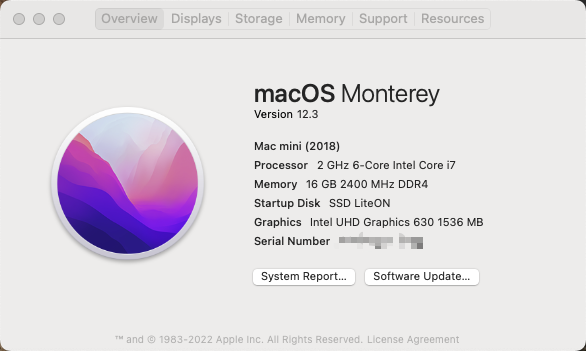

# README

Lenovo M710q QNCT Hackintosh with OpenCore 0.7.6

## Available OS Version

* BigSur 11.3.1 
* Monterey 12.3

## Hardware spec

CPU: Intel QNCT(Intel i7-8850H ES)
GPU: Intel UHD630
RAM: 16G Samsung DDR4 2400MHz
SSD: Lite-On CA3-8D512 512G NVMe SSD
HDD: Seagate ST1000LM048-2E7172 1T 2.5' HDD
LAN: Intel i219-V
Audio: Realtek ALC294
Wireless: Intel 8260AC
SMBIOS: MacMini8,1
Display: ASUS VG289Q1A 28-inch 4K

## Bios settings

BIOS Verison: M1AKT51A

* Disable CSM
* DVMT -> 128M

## Creds

Thanks: @daliansky
